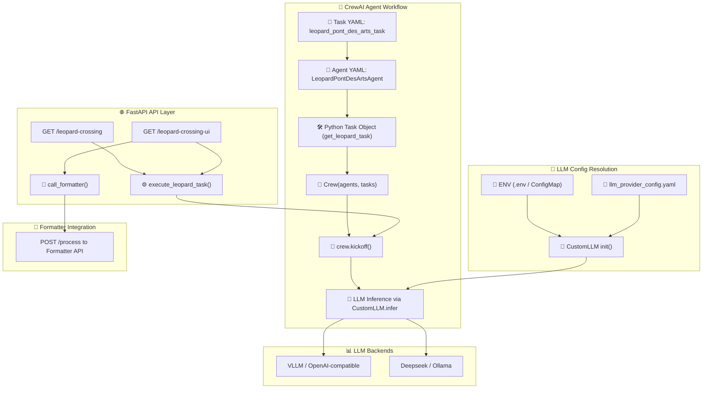

# **🚀 Leopard Pont Des Arts API**

## Architecture



**Leopard Pont Des Arts** is an **AI-powered agent** built using **CrewAI**, integrating **real-time web search** and **large language models (LLMs)** to generate intelligent responses.

This AI assistant:
- ✅ **Fetches real-time information** via **DuckDuckGo search**
- ✅ **Processes search & input data using an LLM** (Supports vLLM, OpenAI, Ollama, DeepSeek, and more)
- ✅ **Uses CrewAI for structured AI workflows**
- ✅ **Supports multiple deployment options** (Local, Podman, OpenShift)

It is designed for **automated research, AI-enhanced decision-making, and knowledge retrieval**.

---

## **📌 Features**
- ✅ **Multi-LLM Provider Support** – Works with OpenAI, vLLM, Ollama, DeepSeek, Cohere, Mistral, Anthropic, Gemini, Meta, and more
- ✅ **CrewAI Agent Framework** – Implements structured AI-driven responses
- ✅ **DuckDuckGo Search Integration** – Enhances AI answers with **live search results**
- ✅ **FastAPI-based REST API** – Easily extendable for additional AI workflows
- ✅ **Environment Config Support** – Works with `.env` or Kubernetes `ConfigMap`
- ✅ **Podman Desktop & OpenShift Ready** – Supports both **containerized and cloud-based deployments**
- ✅ **Works on Any OS** – Uses **virtual environments (venv)** and **Podman**, avoiding OS dependencies

---

## **🛠️ Setup Instructions**

### **1️⃣ Local Development (Without Podman)**
#### **🔹 Prerequisites**
- **Python 3.11+**
- **pip & virtualenv**

#### **🔹 Install & Run**
```bash
# Clone the repository
git clone https://github.com/your-repo/leopard_pontdesarts.git
cd leopard_pontdesarts

# Create and activate virtual environment
python -m venv venv
source venv/bin/activate  # Linux/macOS
venv\Scripts\activate      # Windows

# Install dependencies
pip install -r requirements.txt

# Create a `.env` file with your API credentials
cp .env.example .env
nano .env  # Update API keys and model details

# Run the API on port 8082
PORT=8082 python -m src.main --mode api
```

#### **🔹 Test the API (cURL Examples)**
```bash
curl -X GET http://127.0.0.1:8082/
curl -X GET http://127.0.0.1:8082/leopard-crossing
```

---

### **2️⃣ Run with Podman**
#### **🔹 Prerequisites**
- **[Podman Installed](https://podman.io/getting-started/installation)**
- **Podman Desktop (Optional, for GUI management)**

#### **🔹 Build & Run with Podman**
```bash
# Build the container
podman build -t quay.io/yourusername/leopard_pontdesarts:latest .

# Run the container with .env file (Port 8082)
podman run --env-file .env -p 8082:8000 quay.io/yourusername/leopard_pontdesarts:latest

# OR Run with inline -e parameters
podman run -p 8082:8000 \
  -e LLM_PROVIDER="vllm" \
  -e LLM_BASE_URL="http://localhost:8000" \
  -e LLM_MODEL="/var/home/instruct/.cache/instructlab/models/Qwen/Qwen2.5-Coder-32B-Instruct" \
  quay.io/yourusername/leopard_pontdesarts:latest
```

---

### **3️⃣ Deploy via Podman Desktop (Kube YAML)**
#### **🔹 Steps**
1. **Create the Pod & ConfigMap** using the provided `pod.yaml`
2. **Apply YAML in Podman Desktop**
   ```bash
   podman kube play pod.yaml
   ```
3. **Check Running Containers**
   ```bash
   podman ps -a
   ```

#### **🔹 Access the API**
```bash
curl -X GET http://localhost:8082/
curl -X GET http://localhost:8082/leopard-crossing
```

---

## **📄 API Endpoints**
| Method | Endpoint                   | Description                         |
|--------|----------------------------|-------------------------------------|
| GET    | `/`                        | API health check                   |
| GET    | `/leopard-crossing`        | Retrieves AI-generated response    |
| GET    | `/leopard-crossing-ui`     | Fetches a structured response via UI |

---

## **📦 Environment Configuration**
The app reads values from `.env` or a `ConfigMap`.

### **✅ `.env` Example**
```ini
LLM_PROVIDER="vllm"  # Change to "openai", "ollama", etc.
LLM_BASE_URL="http://localhost:8000"
LLM_MODEL="/var/home/instruct/.cache/instructlab/models/Qwen/Qwen2.5-Coder-32B-Instruct"
LLM_API_KEY="your-secret-key"  # If required
FORMATTER_API_URL="http://localhost:8001/process"
CHROMA_DB_PATH="/opt/app-root/src/.local/chroma_db"
LOG_LEVEL="INFO"
```

### **✅ `ConfigMap` Equivalent (for Kubernetes/Podman)**
```yaml
apiVersion: v1
kind: ConfigMap
metadata:
  name: leopard-config
data:
  LLM_PROVIDER: "vllm"
  LLM_BASE_URL: "http://localhost:8000"
  LLM_MODEL: "/var/home/instruct/.cache/instructlab/models/Qwen/Qwen2.5-Coder-32B-Instruct"
  LLM_API_KEY: "your-secret-key"
  FORMATTER_API_URL: "http://localhost:8001/process"
  CHROMA_DB_PATH: "/opt/app-root/src/.local/chroma_db"
  LOG_LEVEL: "INFO"
```

---

## **🚀 Example Run Output**
Below is an example output when running the application using **Podman** with the **Ollama LLM provider** and a locally hosted model.

### **🔹 Run the Application with Podman**
```bash
podman run -p 8082:8000 \
  -e LLM_PROVIDER="ollama" \
  -e LLM_BASE_URL="http://localhost:8000" \
  -e LLM_MODEL="/var/home/instruct/.cache/instructlab/models/Qwen/Qwen2.5-Coder-32B-Instruct" \
  quay.io/yourusername/leopard_pontdesarts:latest
```

### **🔹 Console Output**
```
2025-02-03 01:10:27,748 - INFO - 🔍 Loaded LLM_MODEL: /var/home/instruct/.cache/instructlab/models/Qwen/Qwen2.5-Coder-32B-Instruct
2025-02-03 01:10:27,749 - INFO - 🔍 Loaded LLM_BASE_URL: http://localhost:8000
2025-02-03 01:10:27,749 - INFO - 🔍 LLM_API_KEY: SET
INFO:   Started server process [1]
...
2025-02-03 01:10:44,079 - INFO - ✅ Using LLM Provider: ollama | Model: /var/home/instruct/.cache/instructlab/models/Qwen/Qwen2.5-Coder-32B-Instruct
...
```

### **🔹 LLM API Response**
```json
{
  "time_seconds": 9.44,
  "explanation": "The time taken for a leopard running at 58 km/h to cross a 155-meter bridge is calculated by converting the speed to m/s and then using the formula Time = Distance / Speed."
}
```

### **🔹 API Call Example**
Once the application is running, you can test the `/leopard-crossing` API endpoint:
```bash
curl -X GET http://127.0.0.1:8082/leopard-crossing
```

Expected **response:**
```json
{
  "time_seconds": 9.44,
  "explanation": "The time taken for a leopard running at 58 km/h to cross a 155-meter bridge is calculated by converting the speed to m/s and then using the formula Time = Distance / Speed."
}
```

---

## **🎯 Summary**
| Mode               | Command |
|--------------------|---------|
| **Local (No Podman)** | `PORT=8082 python -m src.main --mode api` |
| **Podman CLI (Using .env)** | `podman run --env-file .env -p 8082:8000 quay.io/yourusername/leopard_pontdesarts:latest` |
| **Podman CLI (Inline -e Variables)** | `podman run -p 8082:8000 -e LLM_PROVIDER="vllm" -e LLM_BASE_URL="http://localhost:8000" -e LLM_MODEL="..." quay.io/yourusername/leopard_pontdesarts:latest` |
| **Podman Desktop (Kube)** | `podman kube play pod.yaml` |

---

